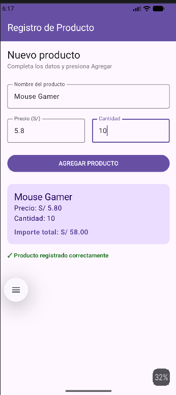

# Laboratorio 03: Registro de Producto (Parte A - Sin IA)

**Estudiante:** Ramses Alvarez  
**Curso:** Programación en Móviles  
**Institución:** Tecsup

---

## 📱 Descripción del Proyecto
Aplicación móvil desarrollada en **Android Studio** utilizando **Kotlin** y **Jetpack Compose**. La aplicación permite registrar la información de un producto (nombre, precio unitario y cantidad) para realizar el cálculo automático del importe total y mostrar un resumen detallado utilizando componentes modernos de Material Design 3.

---

## ✨ Características Implementadas
- **Restricción de entradas (Validación de tipeo):**
    - **Nombre del producto:** Acepta únicamente letras, números y espacios.
    - **Precio:** Acepta números decimales.
    - **Cantidad:** Acepta exclusivamente números enteros.
- **Cálculo de importe:** Multiplica el precio por la cantidad ingresada.
- **Visualización de resumen:** Muestra el resultado dentro de un componente `Card` estilizado.
- **Confirmación visual:** Muestra un mensaje en color verde (`✓ Producto registrado correctamente`).

---

## 📷 Resultado en Emulador

